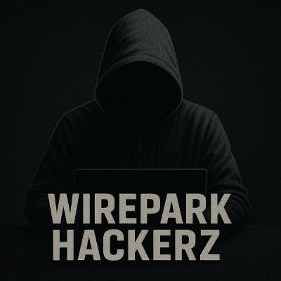

<p align="center">
  
</p>

<h1 align="center">
  P3N73S7 L4B :: NIGHTFALL
</h1>

<p align="center">
  <b>[ Story-Driven Pentesting Training ]</b><br>
  <i>Learn exploitation through conspiracy</i>
</p>

```
    ██████╗ ██████╗ ███╗   ██╗███████╗██████╗ ███████╗
    ██╔══██╗╚════██╗████╗  ██║╚════██║██╔════╝╚════██║
    ██████╔╝ █████╔╝██╔██╗ ██║  ███╔═╝█████╗   ███╔═╝
    ██╔═══╝  ╚═══██╗██║╚██╗██║ ███╔╝  ██╔══╝  ███╔╝
    ██║     ██████╔╝██║ ╚████║███████╗███████╗███████╗
    ╚═╝     ╚═════╝ ╚═╝  ╚═══╝╚══════╝╚══════╝╚══════╝
                L4B :: NIGHTFALL
```

---

## 0x00 // WHAT IS THIS?

**This isn't just a pentesting lab. It's a conspiracy you'll uncover one hack at a time.**

Nine episodes. Each one teaches you a real exploit—port scanning, brute forcing, SQL injection, command injection. The technical skills are real. The commands work. The vulnerabilities are authentic.

But while you're learning to break into systems, a story will emerge. Encrypted messages from a handler. Evidence files on compromised servers. A whistleblower who disappeared. A plot called **NIGHTFALL** that connects them all.

**By the time you reach Episode 9, you'll know:**
- How to exploit backdoored FTP servers and crack SSH passwords
- How to upload malicious web apps and inject commands through forms
- How to bypass authentication with SQL injection and compromise file shares
- How to reverse-engineer build systems and extract database contents

**And you'll know what NIGHTFALL is.**

The narrative doesn't get in the way of the learning—it amplifies it. Every exploit has context. Every compromise reveals another piece of the puzzle. Every command you type moves you closer to the truth.

---

## 0x01 // QUICK START

### On Your Mac (Local Development)
```bash
cd ~/Projects/metasploit
./lab.sh                # Starts Lab UI at http://localhost:5050
```

### On Production (Box - Already Running)
Just browse to: **http://10.0.0.125:5050**

The Lab UI and Kali attack box are already running persistently.

### Three URLs to Remember
| URL | What |
|-----|------|
| http://localhost:5050 (or 10.0.0.125:5050) | Lab UI - Story-driven lessons |
| http://localhost:7681 (or 10.0.0.125:7681) | Kali Terminal - Full Kali in browser |
| http://localhost:9999 | Dozzle - Docker log viewer |

### Remote Access via Tailscale
From any device on your Tailscale network:
- Lab UI: `http://<tailscale-ip>:5050`
- Kali Terminal: `http://<tailscale-ip>:7681`

### Public Access via Tailscale Funnel
```bash
./funnel.sh start   # Expose lab to internet (HTTPS)
./funnel.sh stop    # Close public access
./funnel.sh status  # Check current state
```

When Funnel is active:
- Lab UI: `https://shaggy.<tailnet>.ts.net`
- Kali terminal: `https://shaggy.<tailnet>.ts.net:8443`

**⚠️ SECURITY WARNING:** Funnel exposes Kali root shell to the internet with no authentication. Only use for trusted friends or demonstrations. Stop immediately after use.

---

## 0x02 // THE NIGHTFALL STORY

### The Premise
Three weeks ago, you intercepted encrypted traffic by accident. What you found referenced something called **NIGHTFALL**—a coordinated attack on US critical infrastructure.

Power grids. Hospitals. Water treatment. Financial networks. And every piece of evidence points to China.

**But it's a lie. NIGHTFALL is domestic. And you're the only one who knows.**

Since you started digging, your apartment was searched. Your accounts were probed. A car has been parked outside for six days.

The only way out is through.

### The Nine Episodes

**Episode 1: THE FORGOTTEN DOOR** (vsftpd Backdoor)
An old FTP server Cerberus Systems forgot to decommission. Your first lead on NIGHTFALL. David Chen's name appears repeatedly in the files.

**Episode 2: THE ANALYST** (SSH Brute Force)
David Chen was a Cerberus systems administrator gathering evidence. He disappeared three weeks ago. His workstation is still online. His password was deliberately weak—breadcrumbs for someone who would come looking.

**Episode 3: THE DEPLOYMENT** (Tomcat Manager Upload)
Cerberus's deployment server staging SCADA-BRIDGE—the attack toolkit. Buried in the code: Chinese language strings, Beijing IP addresses, Mandarin error messages. They're not just planning an attack. They're framing another country for it.

**Episode 4: SHARED SECRETS** (SambaCry)
Executive file shares. Marcus Webb's private documents. Wire transfers to shell companies. Meeting notes with clearance levels. And surveillance photos of David Chen dated the week before he disappeared.

**Episode 5: THE BUILD FARM** (DistCC RCE)
Distributed compilation infrastructure building SCADA-BRIDGE at scale. Source code comments in Chinese. Debug symbols pointing to fake Chinese usernames. False flag engineering.

**Episode 6: INPUT VALIDATION** (DVWA Command Injection)
Cerberus's customer portal. Behind the corporate facade: shell companies, fake transactions, millions in money laundering. And the first reference to **PROMETHEUS**—the primary investor funding NIGHTFALL.

**Episode 7: THE QUERY** (DVWA SQL Injection)
Direct database access reveals the full NIGHTFALL target list. Power substations. Water treatment facilities. Financial clearinghouses. Dates. Times. GPS coordinates. The attack is scheduled. 72 hours remaining.

**Episode 8: STOREFRONT** (Juice Shop SQL Injection)
Cerberus's e-commerce front disguising financial transactions. Transaction records tagged SCADA-BRIDGE, ATTRIBUTION-PKG, NIGHTFALL-STAGING. Wire transfers to PROMETHEUS. The account traces to... a United States Senator.

**Episode 9: THE TRUTH** (Finale)
Senator Marcus Webb. The same name on deployment approvals. The same person whose files you found. He wasn't just a Cerberus executive—he IS Cerberus. A sitting Senator who secretly owns 40% of the company. NIGHTFALL was insurance: create the attack, introduce emergency legislation, win $4 billion in cybersecurity contracts. And America would be too scared to question the cost.

David Chen died trying to expose this. You finished what he started.

---

## 0x03 // TECHNICAL ARCHITECTURE

### The Lab Environment

**Host Machine:** Mac (shaggy)
- Metasploit Framework (`/opt/metasploit-framework/`)
- SET (Social Engineering Toolkit) at `~/set/`
- Hydra, John, SQLMap, Nmap, Nikto, Gobuster via Homebrew
- Config files: `~/.msf4/` (symlinked to this repo's `msf-dotfiles/`)

**Production Server:** Linux (box)
- Flask Lab UI running on port 5050
- Kali container always running
- All vulnerable target containers on demand
- Tailscale for remote access

**Docker Network:** `172.20.0.0/24 (lab)`
```
172.20.0.1   - Host (attacker - your Mac/box)
172.20.0.5   - Kali attack box (web terminal at :7681)
172.20.0.10  - DVWA (Episodes 6 & 7)
172.20.0.15  - vsftpd (Episode 1)
172.20.0.16  - Samba (Episode 4)
172.20.0.17  - Vulnerable SSH (Episode 2)
172.20.0.18  - Vulnerable MySQL
172.20.0.19  - Tomcat (Episode 3)
172.20.0.20  - Metasploitable2/DistCC (Episode 5)
172.20.0.30  - Juice Shop (Episode 8)
172.20.0.40  - WebGoat
172.20.0.50  - Mutillidae
172.20.0.60  - WordPress
172.20.0.70  - bWAPP
172.20.0.100 - Cowrie honeypot
```

### Port Bindings

| Service | Host Port | Binding | Notes |
|---------|-----------|---------|-------|
| Lab UI | 5050 | 0.0.0.0 | Flask app, Tailscale accessible |
| Kali Terminal | 7681 | 0.0.0.0 | ttyd web terminal, Tailscale accessible |
| DVWA | 8080 | 127.0.0.1 | Local only (accessed from Kali) |
| Juice Shop | 3000 | 127.0.0.1 | Local only (accessed from Kali) |
| WebGoat | 8081 | 127.0.0.1 | Local only (accessed from Kali) |
| Dozzle | 9999 | 127.0.0.1 | Docker log viewer |

**Note:** Port 5000 is used by macOS AirPlay Receiver, so Lab UI uses 5050.

### Lab UI Stack

- **Backend:** Flask (Python) on port 5050
- **Frontend:** Vanilla HTML/CSS/JS (no frameworks)
- **Styling:** Dark hacker theme with CSS variables
- **Data:** JSON files for lessons (no database)
- **Terminal:** Embedded iframe to ttyd on port 7681
- **Story Mode:** Default - story-driven narrative experience
- **Training Mode:** Optional - original grid view without story

### Lab UI Features

**1. Story Mode (Default)**
- Landing page teases the experience without spoiling the plot
- 9 sequential episodes with interstitials
- Handler messages (encrypted briefings)
- Episode intros (narrative context)
- Episode outros (cliffhangers and next target setup)
- Progress tracking within each lesson
- Automatic container management (stop previous, start current)

**2. Finale Page (Episode 9)**
- Complete story payoff (PROMETHEUS reveal, Webb indictment)
- Comprehensive technical review of all 8 hack labs
- Skill breakdown by episode (40+ specific techniques)
- Cybersecurity kill chain competencies
- Tools mastered (Metasploit, Nmap, Hydra, SQLMap, etc.)
- Professional certification roadmap (eJPT, PNPT, CEH, OSCP)
- Practice platforms (HTB, THM, PortSwigger, PentesterLab)
- Next skills to develop (AD, privesc, web apps, scripting)
- Legal and ethical considerations

**3. Training Mode (Optional)**
- Grid view of all available labs
- Filter by difficulty (easy/medium/hard)
- No narrative context
- Direct access to hack labs

**4. Container Management**
- Auto-start target containers when launching episodes
- Auto-stop previous targets to conserve resources
- "Stop All Targets" button (keeps Kali running)
- Live status indicators
- Docker logs via Dozzle

**5. Kali Integration**
- Persistent Kali container with `/root` volume
- Web terminal accessible at port 7681 (ttyd)
- Embedded in lesson pages via iframe
- Metasploit, Hydra, John, SQLMap, Nmap pre-installed
- Shared wordlists (SecLists submodule)
- Metasploit configs synced via bind mount

---

## 0x04 // THE LESSONS

### Episode Structure (JSON Format)

Each lesson is a JSON file in `lab-ui/lessons/` with:

```json
{
  "id": "lesson-id",
  "name": "Lesson Title",
  "difficulty": "easy|medium|hard",
  "container": "docker-service-name",
  "ip": "172.20.0.X",
  "port": 80,
  "short_description": "One-liner for cards",
  "description": "Full description",

  "episode_number": 1,
  "episode_title": "EPISODE TITLE",
  "next_episode_id": "next-lesson-id",

  "handler_message": "Encrypted briefing from your anonymous handler",
  "episode_intro": "Narrative context before you start hacking",
  "episode_outro": "Cliffhanger and next target setup",

  "interstitial": {
    "title": "Episode X: TITLE",
    "content": "Previously on NIGHTFALL... story recap and mission briefing"
  },

  "steps": [
    {
      "title": "Step title",
      "command": "Command to copy",
      "narrative": "Technical explanation + story context",
      "expected": "What you should see",
      "duration": "5-10 sec"
    }
  ],

  "success_criteria": "How to know you succeeded",
  "next_steps": ["What to try next"]
}
```

### Current Lessons (9 Total)

1. **vsftpd-backdoor.json** - EP1: THE FORGOTTEN DOOR
2. **ssh-bruteforce.json** - EP2: THE ANALYST
3. **tomcat-upload.json** - EP3: THE DEPLOYMENT
4. **sambacry.json** - EP4: SHARED SECRETS
5. **metasploitable2-distcc.json** - EP5: THE BUILD FARM
6. **dvwa-command-injection.json** - EP6: INPUT VALIDATION
7. **sqli-dvwa.json** - EP7: THE QUERY
8. **juiceshop-sqli.json** - EP8: STOREFRONT
9. **finale.html** - EP9: THE TRUTH (template, not JSON)

---

## 0x05 // WHAT YOU'LL LEARN

### Technical Skills (By Episode)

**Episode 1:** Port scanning (Nmap), service version detection, Metasploit basics, vsftpd 2.3.4 backdoor, reverse shells, post-exploitation recon

**Episode 2:** Credential attacks, Hydra brute forcing, rockyou.txt wordlists, SSH authentication, file system reconnaissance

**Episode 3:** Web application architecture, Tomcat manager, WAR file uploads, default credentials, Java payloads, interactive shell upgrade

**Episode 4:** SMB protocol, SambaCry CVE-2017-7494, shared library injection, root access, document intelligence, evidence collection

**Episode 5:** Distributed systems, DistCC CVE-2004-2687, command injection in compilation requests, low-privilege shells, Python PTY, source code analysis

**Episode 6:** Command injection (OWASP Top 10), shell metacharacters, reverse shell payloads, web form exploitation, database credential harvesting

**Episode 7:** SQL injection fundamentals, authentication bypass, boolean logic exploitation, UNION-based extraction, database enumeration

**Episode 8:** Modern web app SQL injection, Juice Shop challenges, admin panel access, transaction analysis, financial intelligence gathering

**Episode 9:** Comprehensive review, professional certifications, practice platforms, career pathways

### Competencies Acquired

- **Reconnaissance:** Port scanning, service enumeration, version detection, network mapping, OSINT
- **Weaponization:** Metasploit framework, payload selection, exploit configuration, custom payload crafting
- **Delivery:** Web uploads, command injection, SQL injection, XSS, shared library injection
- **Exploitation:** Remote code execution, authentication bypass, privilege escalation, session hijacking
- **Installation:** Shell stabilization, persistence mechanisms, interactive shell upgrade
- **Command & Control:** Reverse shell management, session handling, lateral movement awareness
- **Actions on Objectives:** File system recon, data exfiltration, evidence collection, credential harvesting

### Tools Mastered

- **Metasploit Framework:** Exploit modules, payload architecture, session management
- **Nmap:** Port discovery, service detection, version enumeration
- **Hydra:** Network logon cracking, wordlist attacks, multi-protocol support
- **SQLMap:** Automated SQL injection, database takeover
- **Bash/Linux CLI:** Post-exploitation recon, file searching, log analysis
- **Curl:** HTTP client, web recon, header inspection

---

## 0x06 // INSTALLATION & SETUP

### Prerequisites

- **macOS** (tested on macOS Monterey+)
- **Homebrew** installed
- **Docker Desktop** installed and running
- **Git** installed

### Fresh Install on New Mac

```bash
# 1. Clone the repository
git clone --recursive git@github.com:nixfred/metasploit.git ~/Projects/metasploit
cd ~/Projects/metasploit

# 2. Run installation script
./install.sh

# 3. Source bashrc to load aliases
source ~/.bashrc

# 4. Start the lab
lab
```

### What `install.sh` Does

1. Symlinks `msf-dotfiles/` → `~/.msf4/` (Metasploit configs)
2. Checks for required tools (Metasploit, Docker, etc.)
3. Initializes Git submodules (SecLists wordlists)
4. Builds custom Docker images (vsftpd, WordPress)
5. Creates Docker network (`172.20.0.0/24`)

### Manual Tool Installation

If you need to install the pentesting tools manually:

```bash
# Metasploit Framework
brew install metasploit

# SET (Social Engineering Toolkit)
git clone https://github.com/trustedsec/social-engineer-toolkit ~/set
cd ~/set && pip3 install -r requirements.txt

# Other tools
brew install hydra john-jumbo sqlmap nmap nikto gobuster
```

---

## 0x07 // USAGE

### Starting the Lab

#### On Mac (Local Development)
```bash
cd ~/Projects/metasploit
./lab.sh                # Checks Kali, starts Flask on :5050
```

#### On Box (Production)
Lab UI and Kali are already running persistently. Just browse to:
- http://10.0.0.125:5050

### Accessing Kali

#### From Terminal (Local)
```bash
kali                    # Drops into Kali bash shell
```

Inside Kali:
```bash
ms                      # Launches msfconsole
settool                 # Launches SET
```

#### Via Web Browser
- http://localhost:7681 (local)
- http://10.0.0.125:7681 (from LAN)
- https://shaggy.<tailnet>.ts.net:8443 (via Funnel)

### Playing Through NIGHTFALL

1. **Browse to Lab UI:** http://localhost:5050 (or 10.0.0.125:5050)
2. **Story Mode is default:** Landing page introduces the experience
3. **Click "Start Your Journey Here"** → Episode 1 interstitial
4. **Read the briefing** → Launch Episode 1
5. **Follow the steps** → Copy commands, execute in Kali terminal
6. **Progress tracking** → Mark steps complete as you go
7. **Episode outro** → Cliffhanger and next target revealed
8. **Continue to Episode 2** → Repeat through Episode 8
9. **Episode 9 (Finale)** → Story payoff + comprehensive technical review

### Container Management

Containers are managed automatically:
- Launching an episode starts its target container
- Previous episode's container stops automatically
- Kali always stays running

Manual control:
- **Stop All Targets:** Button on landing page
- **Individual Stop:** Buttons on running target cards
- **Command Line:** `docker stop <container-name>`

---

## 0x08 // FILE STRUCTURE

```
metasploit/
├── README.md              # This file
├── CLAUDE.md              # Project context for Claude AI
├── HISTORY.md             # Project evolution log
├── install.sh             # Setup script (symlinks, submodules, Docker)
├── uninstall.sh           # Removes symlinks, restores backups
├── lab.sh                 # Lab launcher (checks Kali, starts Flask)
├── funnel.sh              # Tailscale Funnel control
├── docker-compose.yml     # 13 vulnerable targets + Kali + Dozzle
│
├── lab-ui/                # Flask web interface
│   ├── app.py             # Backend (routes, container management)
│   ├── requirements.txt   # Python dependencies (just Flask)
│   ├── templates/
│   │   ├── index.html     # Landing page (story intro)
│   │   ├── lesson.html    # Lesson page (steps + terminal)
│   │   ├── interstitial.html  # Episode story briefing
│   │   └── finale.html    # Episode 9 (story payoff + review)
│   ├── static/
│   │   ├── style.css      # Dark hacker theme (~900 lines)
│   │   └── favicon.svg    # Cyber skull logo
│   └── lessons/           # Lesson definitions (JSON)
│       ├── vsftpd-backdoor.json
│       ├── ssh-bruteforce.json
│       ├── tomcat-upload.json
│       ├── sambacry.json
│       ├── metasploitable2-distcc.json
│       ├── dvwa-command-injection.json
│       ├── sqli-dvwa.json
│       └── juiceshop-sqli.json
│
├── kali/                  # Kali attack box
│   └── Dockerfile         # Kali with ttyd web terminal
│
├── targets/               # Vulnerable target containers
│   ├── vsftpd/            # Custom vsftpd 2.3.4 build
│   │   └── Dockerfile
│   └── wordpress/         # Vulnerable WordPress
│       └── Dockerfile
│
├── msf-dotfiles/          # Metasploit configuration (synced to ~/.msf4/)
│   ├── msfconsole.rc      # Auto-run commands on startup
│   ├── modules/           # Custom exploit modules
│   ├── scripts/           # Resource scripts (.rc files)
│   └── history            # Command history (gitignored)
│
├── wordlists/             # Password lists for brute forcing
│   └── seclists/          # Git submodule (14M+ passwords)
│
├── docs/
│   ├── CHEATSHEET.md      # Quick exploit commands per target
│   └── MS_CUSTOMIZATION.md # Metasploit customization guide
│
└── .docker/               # Docker build cache (gitignored)
```

---

## 0x09 // CUSTOMIZATION

### Adding a New Lesson

1. **Create lesson JSON** in `lab-ui/lessons/`
2. **Set episode_number** (if part of NIGHTFALL story)
3. **Write narrative content** (handler_message, episode_intro, episode_outro)
4. **Define steps** with commands and explanations
5. **Add container** to docker-compose.yml if new target needed
6. **Update previous episode's** next_episode_id and outro

### Adding a Custom Metasploit Module

1. Create `.rb` file in `msf-dotfiles/modules/exploits/` (or auxiliary/, post/, etc.)
2. Follow Metasploit module template
3. Run `reload_all` in msfconsole to load

### Creating Resource Scripts

1. Add `.rc` file to `msf-dotfiles/scripts/`
2. Run in msfconsole: `resource ~/.msf4/scripts/yourscript.rc`

### Modifying the Lab UI

**Backend (app.py):**
- Add new routes for custom pages
- Modify container management logic
- Add API endpoints

**Frontend (templates/):**
- Edit HTML templates (Jinja2 syntax)
- Update CSS in `static/style.css`
- Add JavaScript for interactivity

**Lessons (lessons/):**
- Edit JSON files to update content
- No code changes needed for narrative updates

---

## 0x10 // ARCHITECTURE DECISIONS

### Why Story Mode?

Penetration testing is about context. Understanding *why* you're exploiting a vulnerability is as important as knowing *how*. The NIGHTFALL narrative:

- **Provides motivation:** You're not just learning commands—you're exposing a conspiracy
- **Creates progression:** Each episode builds on the last technically and narratively
- **Demonstrates real-world context:** Attacks have consequences, targets have relationships
- **Makes it memorable:** Story-driven learning has higher retention than isolated exercises
- **Shows the adversary perspective:** Understanding attacker motivation improves defense

### Why Flask on Port 5050?

Port 5000 is used by macOS AirPlay Receiver since Monterey. We use 5050 to avoid conflicts.

### Why No Database for Lab UI?

MVP doesn't need it. Lessons are JSON files (easy to edit). Step tracking is session-only (resets on refresh). Future versions could add SQLite for persistent progress tracking.

### Why Persistent Kali Home Directory?

The entire `/root` is a Docker volume. This means:
- Shell history persists
- Metasploit database persists
- Custom tools/scripts survive rebuilds
- Only first build is slow; after that Kali is always ready

### Why `restart: always` on Kali?

With Docker Desktop auto-starting on login, Kali becomes a permanent member of your Mac. Open `http://localhost:7681` anytime and it's there.

### Why Bind Mounts for msf-dotfiles and wordlists?

Git becomes the single source of truth. Edit configs on Mac or in Kali, changes go to the repo, git tracks everything.

### Why Custom vsftpd Dockerfile?

The old `vulnerables/vsftpd-2.3.4` image was removed from Docker Hub. We now build from the infected source at `targets/vsftpd/Dockerfile`.

### Why 0.0.0.0 Binding for Lab UI and Kali Terminal?

To enable Tailscale remote access. Target containers stay on 127.0.0.1 for security—only accessible from Kali.

---

## 0x11 // SECURITY CONSIDERATIONS

### ⚠️ CRITICAL WARNINGS

**1. This Lab is VULNERABLE BY DESIGN**
- All target containers have known, exploitable vulnerabilities
- Never expose this environment to the internet without Tailscale VPN
- Never use these containers in production

**2. Tailscale Funnel Exposes Root Shell**
- When Funnel is active, **anyone on the internet** can access your Kali terminal
- Kali runs as root with no authentication
- They can attack your LAN, access your files, install malware
- **ONLY use Funnel for trusted friends or controlled demonstrations**
- **ALWAYS stop Funnel immediately after use:** `./funnel.sh stop`

**3. Default Credentials Everywhere**
- Tomcat: tomcat/tomcat
- DVWA: admin/password
- Many containers use default/weak credentials
- This is intentional for learning—never use these patterns in real systems

**4. No Network Isolation Between Containers**
- All containers can reach each other on `172.20.0.0/24`
- Kali can reach your host machine and LAN
- Firewall isolation was attempted and removed (complexity vs. security tradeoff)

### Safe Usage Guidelines

✅ **DO:**
- Use on isolated networks (home lab, private VPN)
- Practice on these containers to learn exploitation
- Use Tailscale for remote access (VPN-based security)
- Stop containers when not in use
- Keep Docker Desktop updated

❌ **DON'T:**
- Expose Lab UI or Kali to the internet without VPN
- Use Funnel for extended periods
- Attack systems you don't own
- Use techniques learned here against unauthorized targets
- Commit credentials or sensitive data to git

### Legal Notice

This lab is for **authorized security research and education only**. Using these techniques against systems you don't own or have explicit permission to test is **illegal** under the Computer Fraud and Abuse Act (CFAA) and similar laws worldwide.

**Always:**
- Obtain written authorization before pentesting
- Understand scope and rules of engagement
- Use VPNs and isolated networks
- Report findings responsibly
- Respect privacy and data protection laws

---

## 0x12 // TROUBLESHOOTING

### Lab UI Won't Start

```bash
# Check if port 5050 is in use
lsof -i :5050

# Check Flask errors
cd ~/Projects/metasploit/lab-ui
python3 app.py
```

### Docker Images Won't Pull

```bash
# Docker credential helper issue - add to PATH
export PATH="$PATH:/Applications/Docker.app/Contents/Resources/bin"

# Then retry
docker-compose pull
```

### Metasploit Won't Start

```bash
msfdb reinit   # Reinitialize database
msfdb start    # Start PostgreSQL
msfconsole -x "db_status"
```

### Docker Containers Not Reachable

```bash
docker network ls
docker network inspect metasploit_lab
ping 172.20.0.10  # Test DVWA connectivity
```

### Kali Container Won't Start

```bash
docker-compose logs kali
docker-compose up -d --force-recreate kali
```

### Stop All Targets Button Not Working

If containers have hash prefixes in their names (like `abc123_vsftpd`), recreate them:

```bash
cd ~/Projects/metasploit
docker-compose down
docker-compose up -d
```

This ensures containers use the proper `container_name` from docker-compose.yml.

### Step Tracking Not Working

- Check browser console for JavaScript errors
- Clear localStorage: `localStorage.clear()`
- Hard refresh: Cmd+Shift+R

---

## 0x13 // CONTRIBUTING

This is a personal learning environment, but if you want to add lessons or improve the narrative:

1. Fork the repository
2. Create a feature branch (`git checkout -b feature/new-lesson`)
3. Add your lesson JSON to `lab-ui/lessons/`
4. Test thoroughly (all commands work, story fits narrative)
5. Commit with descriptive messages
6. Push and create a Pull Request

**Lesson Quality Standards:**
- Commands must work as written
- Narrative must fit NIGHTFALL timeline and characters
- Technical explanations must be accurate
- Steps must be clear and actionable
- Expected outputs must match reality

---

## 0x14 // ROADMAP

### Completed ✅
- [x] 8 story-driven hack lab episodes
- [x] Complete NIGHTFALL narrative (9 episodes total)
- [x] Finale with story payoff + technical review
- [x] Auto-managed containers (stop previous, start current)
- [x] Persistent Kali with web terminal
- [x] Tailscale remote access
- [x] Tailscale Funnel for public access
- [x] Step tracking within lessons
- [x] Progress indicators
- [x] Episode interstitials

### Future Possibilities 🔮
- [ ] Additional story arcs (new conspiracies, different antagonists)
- [ ] Persistent user progress tracking (SQLite database)
- [ ] Multi-user support (separate progress, leaderboards)
- [ ] Achievement system (badges for specific exploits)
- [ ] Automated pwn scripts for each episode
- [ ] Video walkthroughs embedded in lessons
- [ ] Hint system (progressive disclosure)
- [ ] Time-based challenges (speedrun mode)
- [ ] Advanced episodes (Active Directory, privilege escalation)
- [ ] Custom CTF challenges
- [ ] Report writing module (professional pentest reports)
- [ ] Authentication for Tailscale Funnel (Tailscale SSO)

---

## 0x15 // CREDITS

**Vulnerable Applications:**
- [DVWA](https://github.com/digininja/DVWA) - Damn Vulnerable Web Application
- [OWASP Juice Shop](https://github.com/juice-shop/juice-shop) - Modern insecure web app
- [Metasploitable2](https://sourceforge.net/projects/metasploitable/) - Intentionally vulnerable Linux VM
- [WebGoat](https://github.com/WebGoat/WebGoat) - OWASP learning platform
- [bWAPP](http://www.itsecgames.com/) - Buggy web application
- [Mutillidae](https://github.com/webpwnized/mutillidae) - OWASP vulnerable web app

**Tools:**
- [Metasploit Framework](https://www.metasploit.com/) - Exploitation framework
- [Kali Linux](https://www.kali.org/) - Penetration testing distribution
- [SecLists](https://github.com/danielmiessler/SecLists) - Security wordlists
- [ttyd](https://github.com/tsl0922/ttyd) - Web-based terminal

**Inspiration:**
- Mr. Robot (TV series) - Narrative style and technical accuracy
- OSCP (Offensive Security Certified Professional) - Hands-on learning methodology
- HackTheBox & TryHackMe - Story-driven cybersecurity platforms

**Created by:** WireParkHackerz
**License:** Private repository - Educational use only
**Contact:** @nixfred

---

## 0x16 // VERSION HISTORY

**v1.0.0 GOLD RELEASE** - NIGHTFALL Complete
- All 8 episodes tested and working
- Episode 9 finale with story payoff
- Comprehensive technical review
- All narrative threads resolved
- Timeline and character consistency verified
- No known bugs or continuity errors

See [HISTORY.md](HISTORY.md) for detailed project evolution.

---

<p align="center">
  <b>One person with the right technical skills can uncover the truth.</b><br>
  <i>You stopped NIGHTFALL. What will you do next?</i>
</p>

---

**⚠️ REMEMBER:** This lab is for authorized security research and education only. Using these techniques against unauthorized systems is illegal. Always obtain written permission before conducting security assessments.
